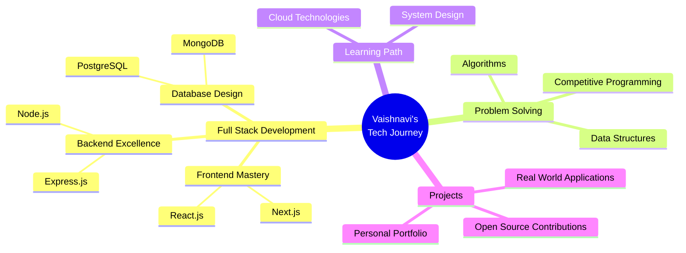

<div align="center">


[](https://git.io/typing-svg)


</div>

---

## 👩‍💻 About Me

```javascript
const VaishnaviSubramaniam = {
    name: "Vaishnavi Subramaniam",
    role: "Computer Science Engineer in the Making",
    location: "Tiruppur, Tamil Nadu 📍",
    education: "Kongu Engineering College, Perundurai 🎓",
    passions: ["Full-Stack Development", "Problem Solving", "Innovation"],
    currentFocus: "Building impactful web applications",
    lifeMotto: "Code with passion, debug with patience",
    
    myApproach: function() {
        while (problemExists) {
            this.analyzeDeep();
            this.codeWithPassion();
            this.testRigorously();
            this.iterateUntilPerfect();
        }
        return "impactful_solution ✨";
    },
    
    sayHi: () => {
        console.log("Thanks for dropping by! Let's build something amazing together 🚀");
    }
};

VaishnaviSubramaniam.sayHi();
```

---

## 🛠️ Tech Arsenal

<div align="center">

### 💻 Languages


### 🚀 Frameworks & Libraries


### 🗄️ Databases


### ⚙️ Tools & Platforms


</div>

---

## 📊 Vaishnavi.exe - System Dashboard

<div align="center">

| 🎯 Skill Area | Progress Bar | Performance | Status |
|---------------|--------------|-------------|--------|
| ⚡ **Energy Level** | ! | **80%** | Powered by Code & Coffee ☕ |
| 🧠 **Learning Mode** | ! | **100%** | Always ON 🔥 |
| 🔧 **Problem Solving** | ! | **85%** | Debugging Champion 🏆 |
| 🎨 **Creativity** | ! | **75%** | Code Artist 🎭 |
| 🤝 **Collaboration** | ! | **85%** | Team Player Ready 🤜🤛 |
| 💡 **Innovation** | ! | **80%** | Thinking Outside the Box 💭 |

</div>

---

## 💻 Competitive Programming Journey

<div align="center">

### 📈 LeetCode Statistics
<a href="https://leetcode.com/vaishnavisubramaniam/">
  
</a>

<br><br>

### 📗 GeeksforGeeks Profile
<a href="https://auth.geeksforgeeks.org/user/vaishnavis08/profile">
  
</a>

### 🎯 Coding Stats
!
!
!

</div>

---

## 📈 GitHub Analytics

<div align="center">


</div>

---

## 🏆 Achievement Showcase

<div align="center">

[](https://github.com/ryo-ma/github-profile-trophy)

</div>

---

## 🔥 Contribution Heat Map

<div align="center">

[](https://github.com/VaishnaviSubramaniam08)

</div>

---

## 🎯 Current Focus

<div align="center">



</div>

---

## 💡 What I'm Up To

- 🔭 Currently working on **Full-Stack Web Applications**
- 🌱 Learning **Advanced React Patterns & System Design**
- 👯 Looking to collaborate on **Open Source Projects**
- 💬 Ask me about **Web Development, Python, Problem Solving**
- 📫 Reach me at **vaishnavisubramaniam247@gmail.com**
- ⚡ Fun fact: **I debug faster than I Google!**

---

## 📊 Weekly Development Breakdown

<!--START_SECTION:waka-->
```text
JavaScript   8 hrs 30 mins   ████████████░░░░░░░░░   45.23 %
Python       5 hrs 15 mins   ███████░░░░░░░░░░░░░░   27.95 %
React        3 hrs 42 mins   ████░░░░░░░░░░░░░░░░░   19.71 %
CSS          1 hr 20 mins    █░░░░░░░░░░░░░░░░░░░░   07.11 %
```
<!--END_SECTION:waka-->

---

## 🎨 Code Philosophy

<div align="center">

> "Code is like humor. When you have to explain it, it's bad." – Cory House

> "First, solve the problem. Then, write the code." – John Johnson

> "Make it work, make it right, make it fast." – Kent Beck

</div>

---

## 📬 Connect With Me

<div align="center">

[](mailto:vaishnavisubramaniam247@gmail.com)
[](https://leetcode.com/vaishnavisubramaniam/)
[](https://auth.geeksforgeeks.org/user/vaishnavis08/profile)
[](https://linkedin.com/in/yourprofile)
[](https://twitter.com/yourhandle)
[](https://yourportfolio.com)

<br>

📍 **Location:** Tiruppur, Tamil Nadu, India  
🎓 **Institution:** Kongu Engineering College, Perundurai  
💼 **Status:** Open to opportunities and collaborations

</div>

---

## 💭 Random Dev Quote

<div align="center">

!

</div>

---

## 😄 Random Dev Meme

<div align="center">


</div>


